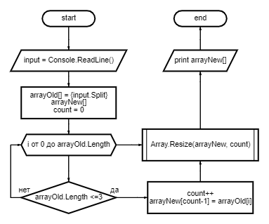

# Итоговая работа

## Введение

Данная инструкция подготовлена в рамках итоговой проверочной работы. Этот текстовый файл описывает пояснение выполнения задачи по формированию массива из строк длиной в три символа посредством отбора элементов из заданного массива.

## Условия задачи

Написать программу, которая из имеющегося массива строк формирует новый массив из строк, длина которых меньше, либо равна 3 символам. Первоначальный массив можно ввести с клавиатуры, либо задать на старте выполнения алгоритма. При решении не рекомендуется пользоваться коллекциями, лучше обойтись исключительно массивами.

## Описание решения задачи

1. Для формирования начального массива вводится переменная *input* типа *string* в которую пользователь вводит через пробел слова:

 __*string input = Console.ReadLine();*__

2. Далее формируем массив из строки *input* посредством команды *Split*:

__*var arrayOld = input.Split(" ");*__

3. Задаем новый массив *arrayNew* с количеством элементов равным начальному массиву. А также задаем переменную, которая в дальнейшем будет определять количество элементов нового массива:

__*string[] arrayNew = new string[arrayOld.Length];*__

__*int count = 0;*__

4. Далее перебираем элементы начального массива посредством оператора цикла *for* для выявления строк длиной не более трех символом, для чего используем оператор *if*. При нахождении искомого элемента увеличиваем переменную *count* на единицу и записываем поочередно в новый массив найденный элемент:

__*for (int i = 0; i <arrayOld.Length; i++);*__

__*{if (arrayOld[i].Length <= 3)*__

__*{count++;*__

__*arrayNew[count-1] = arrayOld[i];}}*__

5. Так как новый массив формируется из начального, то количества его элементов может быть меньше, чем в начальном массиве. Поэтому с помощью встроенного в c# метода изменяем длину нового массива для удаления пустых элементов:

__*Array.Resize(ref arrayNew, count);*__

6. И напоследок выводим получившийся массив:

__*Console.WriteLine($"[{(String.Join(", ", arrayOld))}] --> [{(String.Join(", ", arrayNew))}]");*__

## Блок-схема данной задачи:

 

## End